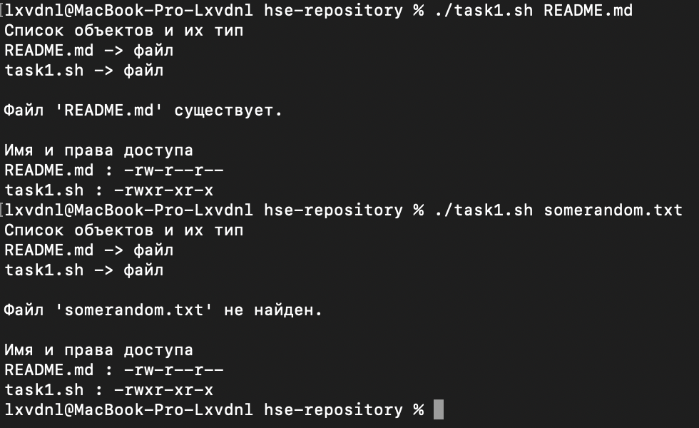
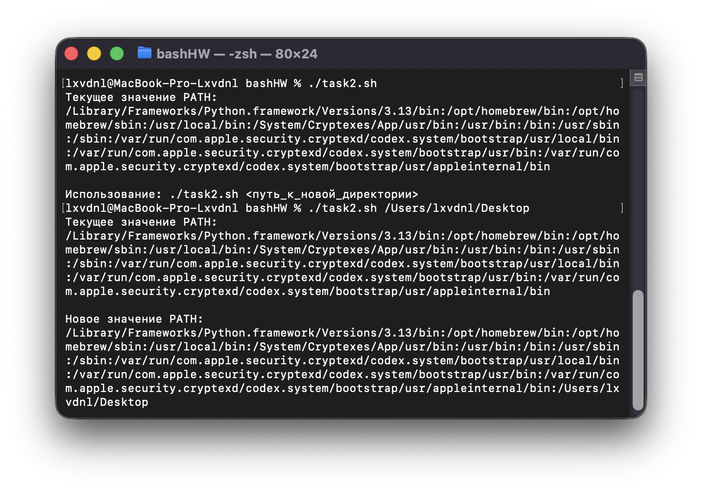
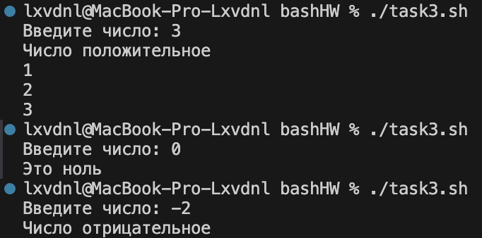
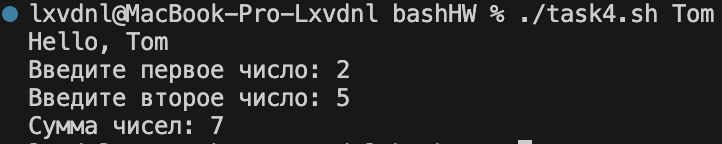
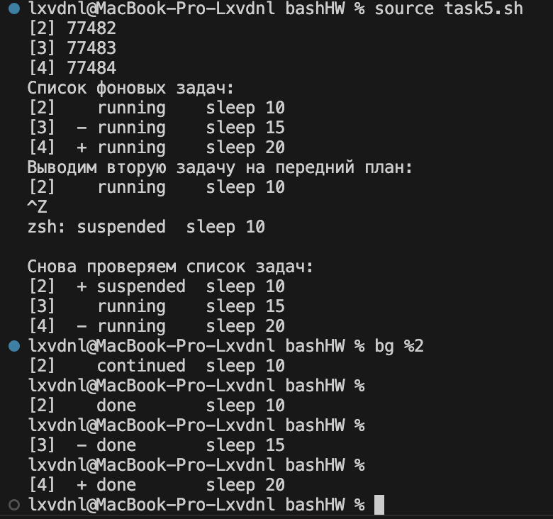
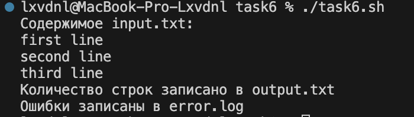
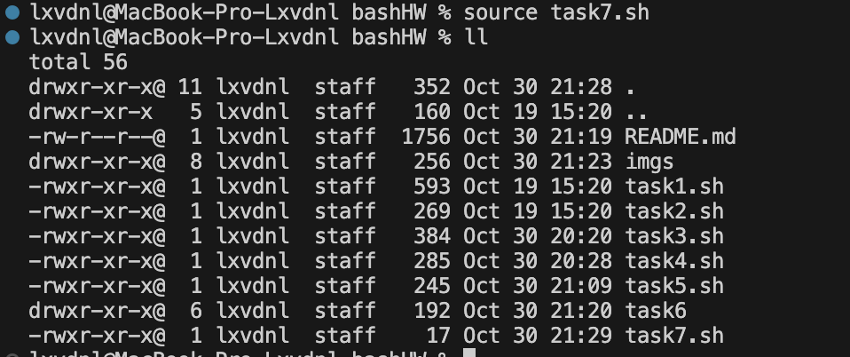

# BASH

### Задание 1
[Скрипт к заданию 1](task1.sh)



### Задание 2
[Скрипт к заданию 2](task2.sh)

При запуске без параметров выводит переменные home и подсказку как пользоваться скриптом, а при запуске с параметром пути рабочего стола добавил его в переменные среды.


Изменения переменной PATH, сделанные через терминал, временные, потому что они действуют только в текущем сеансе Bash.
Чтобы сделать изменения постоянными, нужно добавить строку в файл ~/.bashrc:
``` bash
export PATH="$PATH:/Users/lxvdnl/Desktop"
```
Чтобы применить изменения без перезапуска:
``` bash
source ~/.bashrc
```

### Задание 3
[Скрипт к заданию 3](task3.sh)



### Задание 4
[Скрипт к заданию 4](task4.sh)



### Задание 5
[Скрипт к заданию 5](task5.sh)

На скрине показано, как три команды sleep запускаются в фоне, одна из них переводится на передний план, приостанавливается сочетанием Ctrl+Z, затем возобновляется в фоне и все процессы завершаются.



### Задание 6
[Скрипт к заданию 6](task6/task6.sh)



Файл с количеством строк в input.txt: [output.txt](task6/output.txt)

Файл с логом ошибки: [error.log](task6/error.log)

### Задание 7
[Скрипт к заданию 7](task7.sh)



Этот alias действует только внутри оболочки запущенного скрипта, а чтобы он сохранялся навсегда, его нужно добавить в файл конфигурации ~/.zshrc или ~/.bashrc