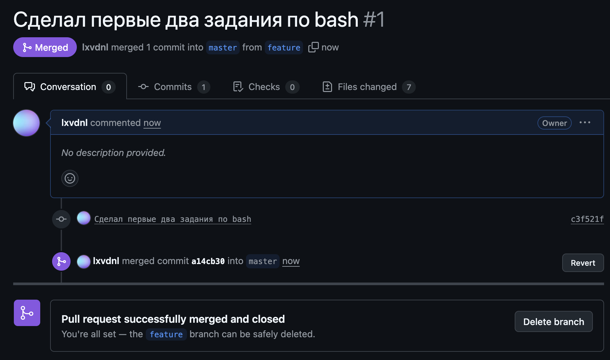

# SHH добавлен

1) Создан и склонирован репозиторий.
2) Создал README.md и закоммитил его в удаленный репозиторий.
3) Закоммитил изменения в новой ветке feature и смерджил в master.

4) Изменил один и тот же файл в ветках master и feature и разрешил конфликт
